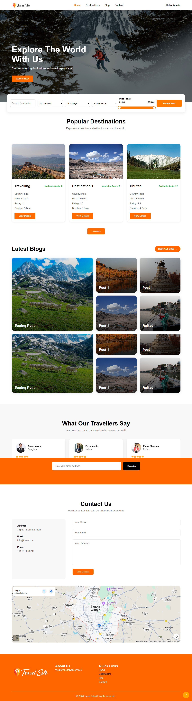
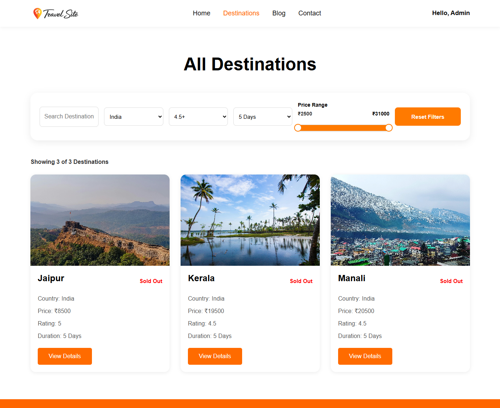
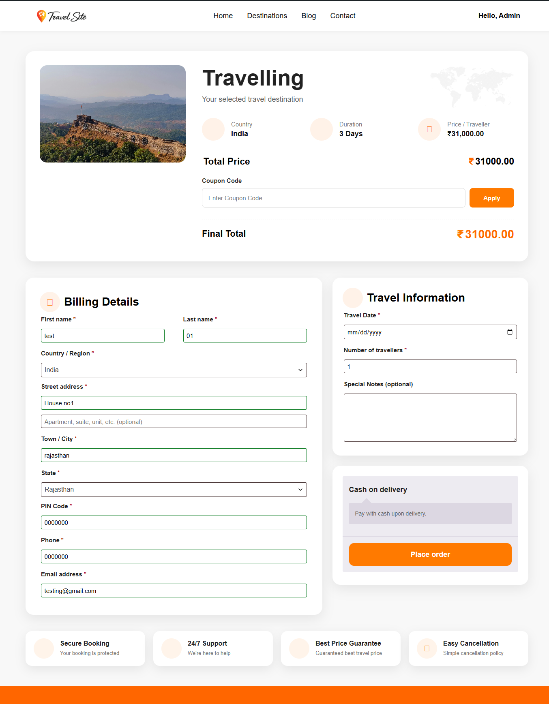
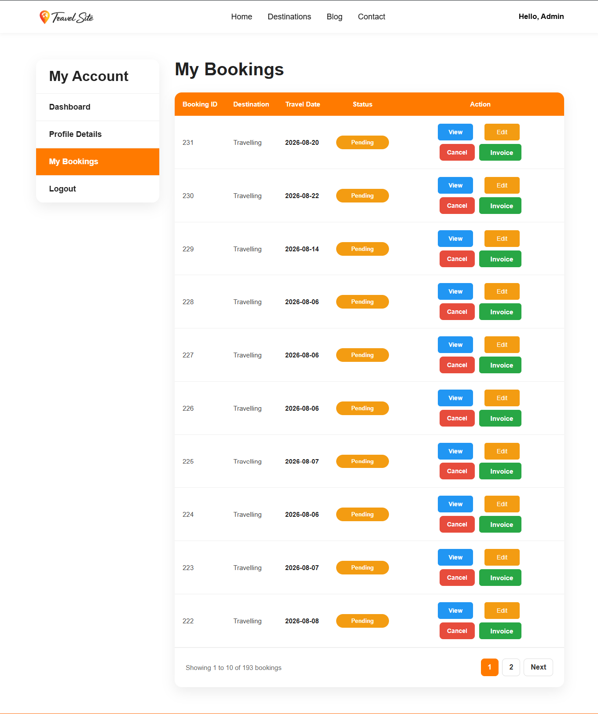

# WordPress Travel Booking System

A custom WordPress travel booking system developed to provide a complete travel booking experience with destination management, advanced filtering, booking management, user dashboard, and WooCommerce integration.

## 🚀 Key Features

- Destination management
- AJAX-based destination filtering
- Search and advanced filters
- Price, rating and duration filtering
- Travel booking system
- Booking management
- User booking dashboard
- Booking cancellation
- Coupons and invoices
- WooCommerce integration
- Responsive frontend design
- Custom checkout experience

## 🛠️ Technologies Used

- WordPress
- PHP
- JavaScript
- AJAX
- HTML5
- CSS3
- MySQL
- WooCommerce
- REST API
- Custom Post Types
- Custom Meta Fields

## 👩‍💻 My Role

- Developed custom WordPress functionality
- Built destination listing and filtering features
- Implemented AJAX-based dynamic functionality
- Developed booking management functionality
- Integrated WooCommerce with the booking system
- Created user booking dashboard
- Worked on responsive frontend development
- Implemented custom checkout and booking flows

## 📸 Screenshots

### Homepage

### Destination Listing

### Booking Form

### Booking Dashboard

## 🔐 Source Code

The complete project source code is maintained in a private repository.

This public repository is created for portfolio and project showcase purposes.
